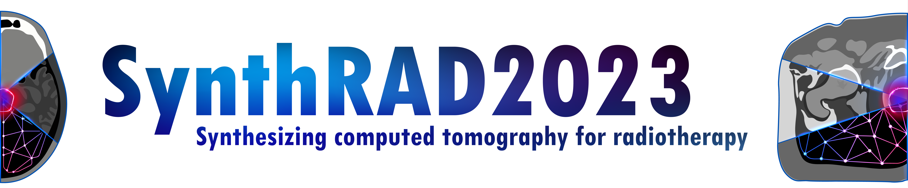

<!-- PROJECT SHIELDS -->
<!--
*** I'm using markdown "reference style" links for readability.
*** Reference links are enclosed in brackets [ ] instead of parentheses ( ).
*** See the bottom of this document for the declaration of the reference variables
*** for contributors-url, forks-url, etc. This is an optional, concise syntax you may use.
*** https://www.markdownguide.org/basic-syntax/#reference-style-links
-->
[![Contributors][contributors-shield]][contributors-url]
[![Forks][forks-shield]][forks-url]
[![Stargazers][stars-shield]][stars-url]
[![Issues][issues-shield]][issues-url]
[![GNU GPL-v3.0][license-shield]][license-url]


<!-- PROJECT LOGO -->
<br />
<p align="center">
  <a href="https://synthrad2023.grand-challenge.org/">
    
  </a>


  <p align="center">
    Preprocessing script: from dicom to aligned nifty for 
<a href="https://synthrad2023.grand-challenge.org/"><strong>SynthRAD2023 Grand Challenge</strong></a>
  <br />
    <a href="https://github.com/SynthRAD2023/preprocessing"><strong>Explore the docs »</strong></a>
    <br />
    <br />
    <a href="https://github.com/SynthRAD2023/preprocessing">View Demo</a>
    ·
    <a href="https://github.com/SynthRAD2023/preprocessing/issues">Report Bug</a>
    ·
    <a href="https://github.com/SynthRAD2023/preprocessing/issues">Request Feature</a>
  </p>
</p>

<!-- TABLE OF CONTENTS -->
## Table of Contents

* [Goal](#goal)
* [Getting Started](#getting-started)
  * [Prerequisites](#prerequisites)
  * [Installation](#installation)
* [Usage](#usage)
  * [Function Descriptions](#functions-descriptions)
* [Roadmap](#roadmap)
* [Contributing](#contributing)
* [License](#license)
* [Contact](#contact)
<!--
* [Acknowledgements](#acknowledgements)
-->


<!-- ABOUT THE PROJECT -->
## Goal

Considering the ``.dcm`` of the MRI (or CBCT), CT of each patient, register to the CT reference grid
after resampling and cropping to reduce the amount of data to be considered for the challenge.


<!-- GETTING STARTED -->
## Getting Started

To get a local copy up and running follow these simple steps.

### Prerequisites

* numpy
```sh
pip install numpy
```
* SimpleITK 
```sh
pip install SimpleITK
```
* SimpleElastix 
```sh
pip install SimpleITK-SimpleElastix
```
* PyDicom
```sh
pip install pydicom
```
* openpyxl
```sh
pip install openpyxl
```
### Installation

1. Clone the repo
```sh
git clone https://github.com/SynthRAD2023/preprocessing.git
```
or
```sh
git clone git@github.com:SynthRAD2023/preprocessing.git
```

<!-- USAGE EXAMPLES -->

## Usage

The main file ``pre_process_tools.py`` is meant to:
* Convert Dicom to nifti (MRI+CT);
* Resample CT to 1x1x1 (for brain);
* Register MR to CT (as a result MRI will also have 1x1x1 spacing) using Elastix;
* Segment patient outline on MRI an dilate mask;
* Crop MRI, CT and the mask with a small extra margin to the dilated mask;

The Elastix parameter files adopted can be found in ``param_files``.

If desired, it is also possible to:
* Apply the mask MRI and CT;

Each of the task can be run as a subfunction of the main file, as describe in the next section.

Examples on how to run for multiple patients can be found in the directory ``examples``:
* ``pre_process_batch_MR.py`` for python-based pre-processing;
* ``pre_process_batch_MR.sh`` for bash-based (terminal) pre-processing in Unix. This file reads the list
of patients provided in ``pat_list_brain_mri2ct.txt``.

The file ``extract_tags_tools.py`` provides functions to:
* Read a list of tags from a text file;
* Extract tags from dicom files and returns a dict containing the key:value pairs
* Get dimension and spacing of pre-processed images
* Write the tags to a csv/excel file

An example of a tag extraction is provided in the directory examples:
*  ``extract_tags_UMCG.py`` shows an example on how to use the above functions for a dataset containing multiple patients and images.

## Functions Descriptions
### Pre-processing:

**convert_dicom_nifti(input, output)**

	description:
	convert a dicom image to compressed nifti using SimpleITK
	
	arguments:
	input: folder containing dicom series (example 'C:\path\containing\Dicom_series')
	output: output file path for compressed nifti (example: 'C:\path\to\folder\image.nii.gz')

	command line usage:
	python pre_process_tools.py convert_dicom_to_nifti --i 'C:\path\containing\Dicom_series' --o 'C:\path\to\folder\image.nii.gz'


**resample(input, output, spacing)**

	description:
	resample nii.gz image using custom spacing (in mm)

	arguments:
	input: file path input image (example: 'C:\path\to\folder\image.nii.gz')
	output: file path resampled image (example: 'C:\path\to\folder\image_resampled.nii.gz')
	spacing: new spacing in mm (example: (1,1,1))

	command line usage:
	python pre_process_tools.py resample --i 'C:\path\to\folder\image.nii.gz' --o 'C:\path\to\folder\image_resampled.nii.gz' --s 1 1 1


**read_parameter_map()**
	
	description:
	read an elastix parameter map from a .txt file and return the parameter map object


**register(fixed, moving, parameter, output)**
	
	description:
	register two images using elasix parameter map

	arguments:
	fixed: file path to fixed image for registration (example: 'C:\path\to\folder\fixed.nii.gz')
	moving: file path to moving image for registration (example: 'C:\path\to\folder\moving.nii.gz')
	parameter: file path to parameter map .txt file (example: 'C:\path\to\folder\parameters.txt')
	output: file path to registered image (example: 'C:\path\to\folder\moving_registered.nii.gz')

	command line usage:
	python pre_process_tools.py register --f C:\path\to\folder\fixed.nii.gz' --m 'C:\path\to\folder\moving.nii.gz' --p 'C:\path\to\folder\parameters.txt'--o 'C:\path\to\folder\moving_registered.nii.gz'


**segment(input, output, radius)**
	
	description:
	create a rough body mask for MR/CBCT/CT image

	arguments:
	input: file path input image (example: 'C:\path\to\folder\image.nii.gz')
	output: file path mask (example: 'C:\path\to\folder\mask.nii.gz')
	radius: currently not used (radius to fill holes in mask), default value =  (12,12,12)

    command line usage:
	python pre_process_tools.py segment --i 'C:\path\to\folder\moving_registered.nii.gz' --o 'C:\path\to\folder\moving_mask.nii.gz' 

**correct_mask_mr(mr,ct,transform,mask,mask_corrected)**

	description:
	limit the mask, generated with above segment function, to the MR FOV

	argumnents:
	mr: file path to mr (original unaltered mr image)
	ct: file path to resampled ct
	transform: path to registration paramters which the register function saves in a file (*_parameters.txt)
	mask: file path to mask generated by segment function
	mask_corrected: file path for corrected mask output

	command line usage:
	not yet implemented

**mask_mr or mask_ct(input, mask_in, output)**

	description:
	mask an image with provided mask (e.g. created by segment above). The background value is -1000 for CT, and 0 for MRI.

	arguments:
	input: file path input image (example: 'C:\path\to\folder\image.nii.gz')
	mask_in: file path to mask (example: 'C:\path\to\folder\mask.nii.gz')
	output: file path to masked image (example: 'C:\path\to\folder\image_masked.nii.gz')


**crop(input, mask_crop, output)**

	description:
	crop an image with bounding box of mask image

	arguments:
	input: file path input image (example: 'C:\path\to\folder\image.nii.gz')
	mask_crop: file path to mask, used to calculate bounding box (example: 'C:\path\to\folder\mask.nii.gz')
	output: file path to cropped image (example: 'C:\path\to\folder\image_cropped.nii.gz')

### Dicom tag extraction:

**read_tags(input_txt)**

	description:
	read dicom tag strings from a txt file

	arguments:
	input_txt: file path to text file containg dicom tags (see example in param_files)
	
	returns: 
	python list containing dicom tags

**extract_tags(dcm_folder_path,tag_list,pre_processed=None)**

	description:
	extracts tags from a folder containg dicom files (only from the first element) and from pre-processed nifti images

	arguments:
	dcm_folder_path: path to folder containing dicom image slices
	tag_list: list defining which tags to extract
	pre_processed: path to pre-processed nifti file (can be left out if tags should be only extracted from dicom files)

	returns:
	python dict with dicom tags as key:value pairs


**write_dict_to_csv(input_dict,output_csv,tag_list)**

	description:
	takes a dict containing dicom tags and writes it to a csv file

	arguments:
	input_dict: dict containing extracted tags
	output_csv: filename of output csv file
	tag_list: list of dicom tags, necessary to create header in csv file


**write_csv_to_xlsx(input_csv,output_xlsx)**

	description:
	takes a csv and creates an xlsx file

	arguments:
	input_csv: path to csv file
	output_xlsx: filepath of output xlsx file


<!-- ROADMAP -->
## Roadmap

See the [open issues](https://github.com/SynthRAD2023/preprocessing/issues) for a list of proposed features (and known issues).

<!-- CONTRIBUTING -->
## Contributing

Contributions are what make the open source community such an amazing place to be learn, inspire, and create. Any contributions you make are **greatly appreciated**.

1. Fork the Project
2. Create your Feature Branch (`git checkout -b feature/AmazingFeature`)
3. Commit your Changes (`git commit -m 'Add some AmazingFeature'`)
4. Push to the Branch (`git push origin feature/AmazingFeature`)
5. Open a Pull Request

<!-- LICENSE -->
## License

Distributed under the GNU General Public License v3.0. See `LICENSE` for more information.

<!-- CONTACT -->
## Contact

Adrian Thummerer - - mail here  
Matteo Maspero - [@matteomasperonl](https://twitter.com/matteomasperonl) - m.maspero@umcutrecht.nl

Project Link: [https://github.com/SynthRAD2023/preprocessing](https://github.com/SynthRAD2023/preprocessing)


<!-- ACKNOWLEDGEMENTS 
## Acknowledgements

* []()
* []()
* []()
-->

<!-- MARKDOWN LINKS & IMAGES -->
<!-- https://www.markdownguide.org/basic-syntax/
#reference-style-links -->
[contributors-shield]: https://img.shields.io/github/contributors/SynthRAD2023/repo.svg?style=flat-square
[contributors-url]: https://github.com/SynthRAD2023/repo/graphs/contributors
[forks-shield]: https://img.shields.io/github/forks/SynthRAD2023/repo.svg?style=flat-square
[forks-url]: https://github.com/SynthRAD2023/repo/network/members
[stars-shield]: https://img.shields.io/github/stars/SynthRAD2023/repo.svg?style=flat-square
[stars-url]: https://github.com/SynthRAD2023/repo/stargazers
[issues-shield]: https://img.shields.io/github/issues/SynthRAD2023/repo.svg?style=flat-square
[issues-url]: https://github.com/SynthRAD2023/repo/issues
[license-shield]: https://img.shields.io/github/license/SynthRAD2023/repo.svg?style=flat-square
[license-url]: https://github.com/SynthRAD2023/repo/blob/master/LICENSE.txt
